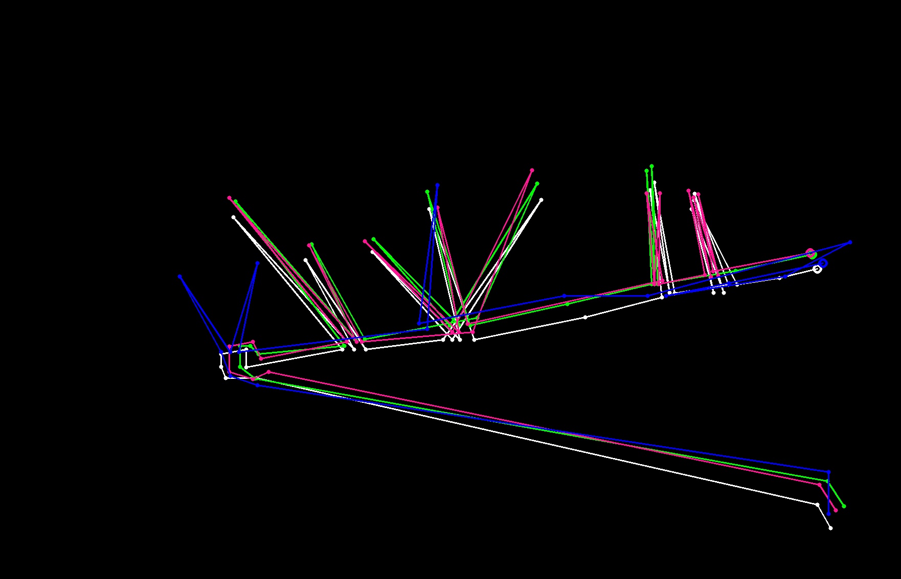

# Tracks Distance

This is a C++ implementation of the algorithms described in 
[this](https://github.com/inzrv/Tracks-Distance-Py) project. 
A detailed description is available in [this README file](https://github.com/inzrv/Tracks-Distance-Py/blob/main/README.md)
(only in Russian yet).

