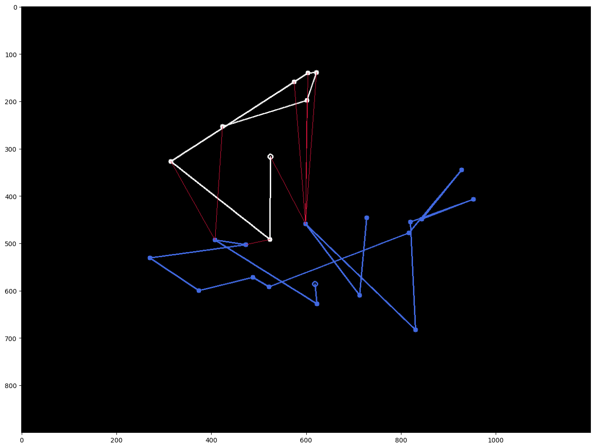
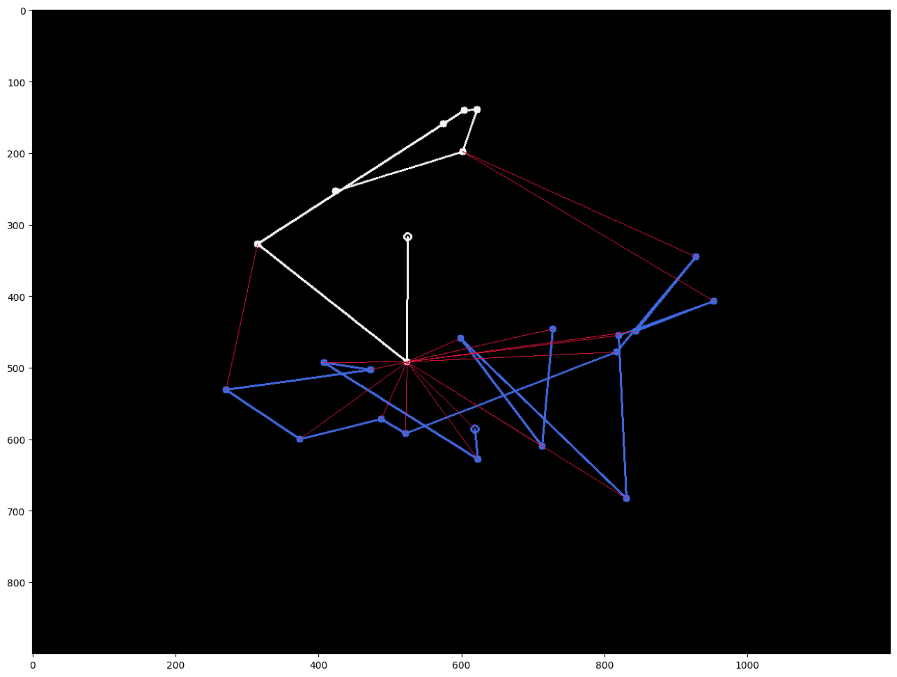

# Tracks Distance

The given project is a C++ implementation of algorithms for calculating the distance between a pair of tracks. 

A *track* or *trajectory* refers to a collection of *observations* or *points*, each defined by its 2D coordinates and the time at which it was observed.

# Theory

The current section is dedicated to the theoretical description of the implemented algorithms.

Let's denote a point $(x, y, t)$ as lowercase: $p \stackrel{def}{=} (x, y, t)$. The set of all points $\lbrace p_i \rbrace$ is denoted by $\mathcal{P}$. A track $T = \lbrace p_i \rbrace$ is a collection of such points. The set of all tracks $\lbrace T_j \rbrace$ is denoted by $\mathcal{T}$.

Let's denote by $d$ and $D$ the functions $d: \mathcal{P} \times \mathcal{P} \to \mathbb{R}$ and $D: \mathcal{T} \times \mathcal{T} \to \mathbb{R}$, respectively, which satisfy the [axioms](https://en.wikipedia.org/wiki/Metric_space#Definition_and_illustration) of a metric.

## Hausdorff Distance

### References

- [Hausdorff distance](https://en.wikipedia.org/wiki/Hausdorff_distance)

- [В.А. Скворцов. "Примеры метрических пространств"](https://www.mccme.ru/mmmf-lectures/books/books/book.16.pdf)

- [An Efficient Algorithm for Calculating the Exact Hausdorff Distance](https://pypi.org/project/hausdorff/)

### Algorithm description

Let $T =  \lbrace v_i ~| ~ i \in 1..n \rbrace, Q = \lbrace u_j ~| ~ j \in 1..m \rbrace$ be two trajectories passed as input to the algorithm, and let $d(v,u)$ be the distance between points computed using the metric function.

To compute the Hausdorff distance, it is necessary to calculate two values:

$$
D(P, Q) = \max_{v_i \in P }{d(v_i, Q)},
$$

$$
D(Q, P) = \max_{u_i \in Q }{d(u_i, P)},
$$

where $d(v, Q) \stackrel{def}{=} \min\limits_{u_i \in Q} { d(v,u_i)}$.

The returned distance between trajectories is 

$$
   H(P, Q)  \stackrel{def}{=}  \max \lbrace D(P, Q), D(Q, P) \rbrace.
$$

### Time Complexity

In this implementation, $D(P, Q)$ and $D(Q, P)$ are computed naively by repeating their definitions. The time complexity of this step depends on the method used to find the nearest point. Currently, a simple brute-force approach is used, which involves iterating through all the points on the other trajectory. However, a more efficient approach such as using a $kd$-tree, as demonstrated in [this](https://github.com/inzrv/Tracks-Distance-Py/blob/main/src/test_task.ipynb) project, could be employed.

So the brute-force algorithm takes $O(nm)$ time, where $n$ and $m$ are the sizes of the tracks. However, by using a $kd$-tree, which has $O(\log n)$ query time, the time complexity can be improved to $O(\max \lbrace n, m \rbrace \log \max\lbrace n, m \rbrace{})$.

### Examples and Illustrations

To demonstrate the algorithm, let's consider two random trajectories.

 In the first image, each point of the white track $T_w$ is connected by a red line segment to the nearest point of the blue track $T_b$. The longest red line segment in the first image represents the distance $D(T_w, T_b)$. 

 
 
 In the second image, each point of the $T_b$ is connected to the nearest point of the $T_w$. The Hausdorff distance $H(T_w, T_b) = 408.512$ between these two trajectories is represented by the longest red line segment.

### Some Comments

The Hausdorff distance may be useful if we want to compare tracks as subsets of the real plane. But in this case, if we have a point $v \in P$, the closest point to it in $Q$ need not necessarily come from the original set of observations $\lbrace u _j\rbrace$.

Dividing the original trajectory into smaller segments is one approach that can be used. This technique has been shown to enable a more efficient search for similar tracks, and conversely, to highlight significant differences between them in practice.