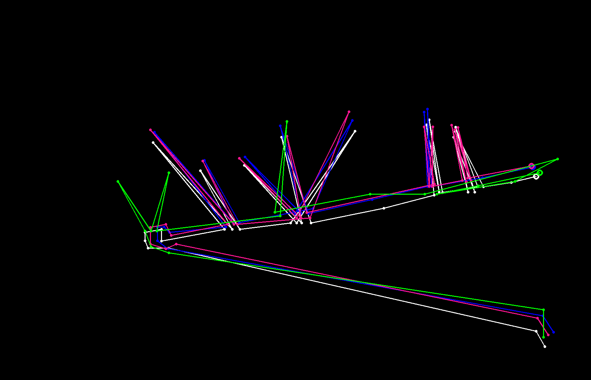

# Tracks Distance

The given project is a C++ implementation of algorithms for calculating the distance between a pair of tracks. 

A *track* or *trajectory* refers to a collection of *observations* or *points*, each defined by its 2D coordinates and the time at which it was observed.

# Theory

The current section is dedicated to the theoretical description of the implemented algorithms.

Let's denote a point $(x, y, t)$ as lowercase: $p \stackrel{def}{=} (x, y, t)$. The set of all points $\lbrace p_i \rbrace$ is denoted by $\mathcal{P}$. A track $T = \lbrace p_i \rbrace$ is a collection of such points. The set of all tracks $\lbrace T_j \rbrace$ is denoted by $\mathcal{T}$.

Let's denote by $d$ and $D$ the functions $d: \mathcal{P} \times \mathcal{P} \to \mathbb{R}$ and $D: \mathcal{T} \times \mathcal{T} \to \mathbb{R}$, respectively, which satisfy the [axioms](https://en.wikipedia.org/wiki/Metric_space#Definition_and_illustration) of a metric.

## Hausdorff Distance
### Algorithm description

Let $T = (v_1, ..., v_n), Q = (u_1, ..., u_m)$ be two trajectories passed as input to the algorithm, and let $d(v,u)$ be the distance between points computed using the metric function.

To compute the Hausdorff distance, it is necessary to calculate two values:

$$
D(P, Q) = \max_{v_i \in P }{d(v_i, Q)},
$$

$$
D(Q, P) = \max_{u_i \in Q }{d(u_i, P)},
$$

where $d(v, Q) \stackrel{def}{=} \min\limits_{u_i \in Q} { d(v,u_i)}$.

The returned distance between trajectories is 

$$
   H(P, Q)  \stackrel{def}{=}  \max \lbrace D(P, Q), D(Q, P) \rbrace.
$$

