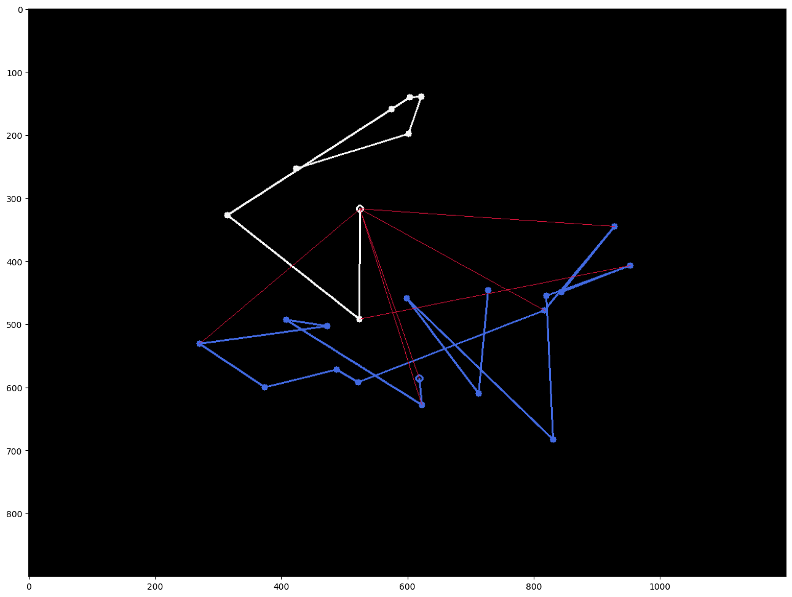

# Tracks Distance

The given project is a C++ implementation of algorithms for calculating the distance between a pair of tracks. 

A *track* or *trajectory* refers to a collection of *observations* or *points*, each defined by its 2D coordinates and the time at which it was observed.

# Theory

The current section is dedicated to the theoretical description of the implemented algorithms.

Let's denote a point $(x, y, t)$ as lowercase: $p \stackrel{def}{=} (x, y, t)$. The set of all points $\lbrace p_i \rbrace$ is denoted by $\mathcal{P}$. A track $T = \lbrace p_i \rbrace$ is a collection of such points. The set of all tracks $\lbrace T_j \rbrace$ is denoted by $\mathcal{T}$.

Let's denote by $d$ and $D$ the functions $d: \mathcal{P} \times \mathcal{P} \to \mathbb{R}$ and $D: \mathcal{T} \times \mathcal{T} \to \mathbb{R}$, respectively, which satisfy the [axioms](https://en.wikipedia.org/wiki/Metric_space#Definition_and_illustration) of a metric.

## Hausdorff Distance

### References

- [Hausdorff distance](https://en.wikipedia.org/wiki/Hausdorff_distance)

- [В.А. Скворцов. "Примеры метрических пространств"](https://www.mccme.ru/mmmf-lectures/books/books/book.16.pdf)

- [An Efficient Algorithm for Calculating the Exact Hausdorff Distance](https://pypi.org/project/hausdorff/)

### Algorithm description

Let $T =  \lbrace v_i ~| ~ i \in 1..n \rbrace, Q = \lbrace u_j ~| ~ j \in 1..m \rbrace$ be two trajectories passed as input to the algorithm.

To compute the Hausdorff distance, it is necessary to calculate two values:

$$
D(P, Q) = \max_{v_i \in P }{d(v_i, Q)},
$$

$$
D(Q, P) = \max_{u_i \in Q }{d(u_i, P)},
$$

where $d(v, Q) \stackrel{def}{=} \min\limits_{u_i \in Q} { d(v,u_i)}$.

The returned distance between trajectories is 

$$
   H(P, Q)  \stackrel{def}{=}  \max \lbrace D(P, Q), D(Q, P) \rbrace.
$$

### Time Complexity

In this implementation, $D(P, Q)$ and $D(Q, P)$ are computed naively by repeating their definitions. The time complexity of this step depends on the method used to find the nearest point. Currently, a simple brute-force approach is used, which involves iterating through all the points on the other trajectory. However, a more efficient approach such as using a $kd$-tree, as demonstrated in [this](https://github.com/inzrv/Tracks-Distance-Py/blob/main/src/test_task.ipynb) project, could be employed.

So the brute-force algorithm takes $O(nm)$ time, where $n$ and $m$ are the sizes of the tracks. However, by using a $kd$-tree, which has $O(\log n)$ query time, the time complexity can be improved to $O(\max \lbrace n, m \rbrace \log \max\lbrace n, m \rbrace{})$.

### Examples and Illustrations

To demonstrate the algorithm, let's consider two random trajectories.

 In the first image, each point of the white track $T_w$ is connected by a red line segment to the nearest point of the blue track $T_b$. The longest red line segment in the first image represents the distance $D(T_w, T_b)$. 

 
 
 In the second image, each point of the $T_b$ is connected to the nearest point of the $T_w$. The Hausdorff distance $H(T_w, T_b) = 408.512$ between these two trajectories is represented by the longest red line segment.

### Some Comments

The Hausdorff distance may be useful if we want to compare tracks as subsets of the real plane. But in this case, if we have a point $v \in P$, the closest point to it in $Q$ need not necessarily come from the original set of observations $\lbrace u _j\rbrace$.

Dividing the original trajectory into smaller segments is one approach that can be used. This technique has been shown to enable a more efficient search for similar tracks, and conversely, to highlight significant differences between them in practice.

Using the example below, the Hausdorff distance $H(P, Q) = 500.0$ between the trajectories $P$ and $Q$ is equal to the length of the long red line segment connecting the points $[1100, 200]$ and $[700, 500]$.

Although in some situations it may seem reasonable to require that the distance between them be equal to $\Delta y = 300$ (or close to it). Dividing the tracks into smaller segments can help achieve this result. For the tracks below, $H(P,Q)=300.666$.

## Fréchet Distance

### References

- [Thomas Eiter and Heikki Mannila, "Computing Discrete Fréchet Distance"](http://www.kr.tuwien.ac.at/staff/eiter/et-archive/cdtr9464.pdf)

- [Fréchet distance](https://en.wikipedia.org/wiki/Fr%C3%A9chet_distance)

- [Quantify the difference between two arbitrary curves in space](https://pypi.org/project/similaritymeasures/)

### Algorithm description

Let $P = (v_1, ..., v_n)$ and $Q = (u_1, ..., u_m)$ be two trajectories passed as input to the algorithm. Note that this algorithm takes into account the order of points in the track, and we assume that $\forall i,~ v_i.t < v_{i+1}.t$.

The Fréchet distance between $P$ and $Q$ can be calculated using dynamic programming. We first create a table $\tau$ of size $n \times m$, where $\tau[i][j]$ will contain the distance between the trajectories $P_i = (v_1, ..., v_i)$ and $Q_j = (u_1, ..., u_j)$ as the algorithm progresses. The desired Fréchet distance is stored in $\tau[n][m]$.

The cells of the table are filled according to the following rules:

1. $\tau[1][1] = d(v_1, u_1)$;

2. $\tau[i][1] = \max \lbrace \tau[i-1][1], ~ d(v_i, u_1) \rbrace$;

3. $\tau[1][j] = \max \lbrace \tau[1][j-1], ~ d(v_1, u_j) \rbrace$;

4. $\tau[i][j] = \max \lbrace \min \lbrace \tau[i-1][j], ~ \tau[i-1][j-1], ~ \tau[i][j-1] \rbrace, ~d(v_i, u_j) \rbrace$

### Time Complexity

The time required to fill the table $\tau$ is $O(n \times m)$, where $n$ and $m$ are the sizes of the trajectories.

### Examples and Illustrations

We will demonstrate the process of calculating the Fréchet distance on the previously considered trajectories $P$ and $Q$. 

There is an interesting way to think about the Fréchet distance (see more [here](https://en.wikipedia.org/w/index.php?title=Fr%C3%A9chet_distance)).

> Imagine a person traversing a finite curved path while walking their dog on a leash, with the dog traversing a separate finite curved path. Each can vary their speed to keep slack in the leash, but neither can move backwards. The Fréchet distance between the two curves is the length of the shortest leash sufficient for both to traverse their separate paths from start to finish. Note that the definition is symmetric with respect to the two curves—the Fréchet distance would be the same if the dog were walking its owner.

 Let the blue track be the dog's path, and the white track be its owner's path. They both start at the bold unfilled point. Among all the ways to walk these routes, the optimal one was chosen in terms of the Fréchet distance. Then the red segments connect the points where the length of the leash increased. Therefore, the Fréchet distance $F(P, Q) = 437.340$ for this case is equal to the length of the longest segment.

## Metrics d(v, u)

Up until now, we have only used the time coordinate of observations to order the points of a trajectory. However, if we want to compare trajectories taking into account the speed at which they were traveled, for example, we need to use the time parameter as well. One idea is to treat points as subsets of a three-dimensional space. In this case, the distance metric $d(v, u)$ can be defined as follows:

$$ d_{xyt}(v, u) = \sqrt{(v.x - u.x)^2 + (v.y - u.y)^2 + \alpha(v.t - u.t)^2} $$

 The parameter $\alpha$ controls the relative importance of the time component in the distance calculation. By adjusting this parameter, we can make the metric more sensitive to changes in time or to changes in space.

As an example of the usefulness of this approach, let's consider the following scenario: we have three tracks denoted as $B$, $G$, and $W$ based on the first letter of their respective colors. Each track is composed of a sequence of points recorded at one-second intervals. 

 

We want to note that the object following the white trajectory moves at a slower pace through specific segments of the path in comparison to the other objects. To do this, we will calculate pairwise Fréchet distances and utilize the previously proposed function as the distance metric. By doing so, we obtain a set of results:

 - $F_{xyt}(W, B) = 801.998,$
 - $F_{xyt}(W, G) = 803.803,$
 - $F_{xyt}(B, G) = 110.000.$

To provide a comparison between the two metrics, we have included the pairwise Fréchet distances and Euclidean distances for the points:

 - $F_e(W, B) = 155.322,$
 - $F_e(W, G) = 140.801,$
 - $F_e(B, G) = 110.000.$

The application of the $d_{xyt}$ metric allows for a clearer differentiation between the various tracks, which can prove to be advantageous in their classification.

